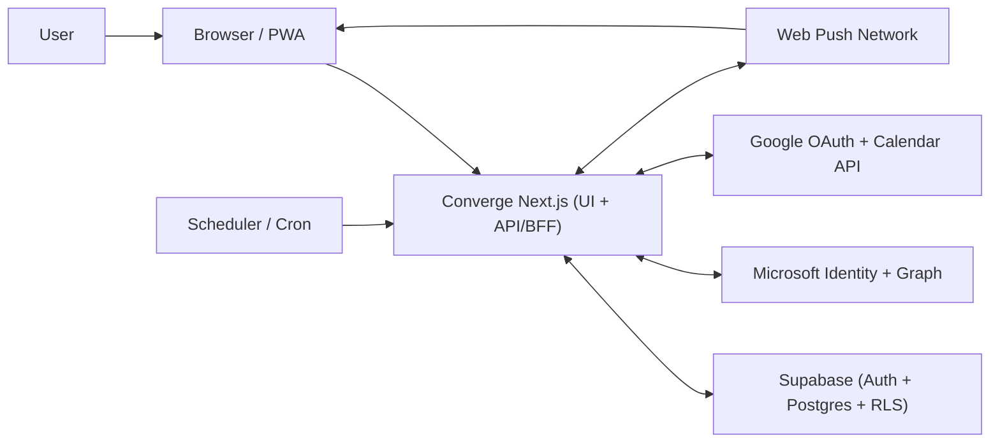

# Converge

Converge is a unified workspace for teams operating Microsoft 365 across multiple tenants.

It aggregates cross-tenant calendars and directory (people) data into a single experience, with fast search, standardized "quick actions" (email, Teams chat, meeting creation), and cross-tenant schedule conflict detection.

## Tech Stack

- Next.js 15 (App Router) + TypeScript
- Supabase (Auth, Postgres, RLS)
- Microsoft Graph API (multi-tenant OAuth)
- Google OAuth + Google Calendar API (optional / partial)
- Tailwind CSS
- Web Push (optional, background notifications)

## Architecture (Overview)

Detailed C4 document: `docs/architecture-overview.md`

### System Context

- Client: Browser/PWA
- Core app: Next.js (BFF)
- System of record: Supabase (Auth + Postgres + RLS)
- External integrations: Microsoft Identity + Graph, Google OAuth + Calendar API, Web Push network
- Trigger source: optional scheduler calling `/api/cron/conflicts`

### Containers

- UI Container: App Router pages/components, service worker (`/public/sw.js`)
- API/BFF Container: Route handlers (`/app/api/*`), auth callback (`/auth/callback`), server actions
- Domain Container: conflict detection, i18n, push helper utilities
- Data Container: Supabase SSR/Admin clients + Postgres tables (`app_users`, `m365_connections`, `calendar_events_cache`, `people_cache`, `push_subscriptions`, `alert_dedup`)

### Main Flows

1. Auth flow: magic link (Supabase) and OAuth callbacks (Microsoft/Google) -> connection/token upsert in Supabase
2. Calendar/people read flow: UI -> Next.js server -> Supabase cached data
3. Alert flow: scheduler -> `/api/cron/conflicts` -> conflict detection -> Web Push send -> dedup update



## Product Scope (Current)

### Pages

- Onboarding: `/onboarding`
- Login: `/login`
- Unified Calendar: `/calendar`
- People (directory search): `/people`
- Settings (connect accounts, language, install/push): `/settings`

### Key Capabilities

- Unified calendar across multiple tenants (week/month navigation + search + tenant toggles)
- Multi-tenant people search with profile-based quick actions
- Cross-tenant schedule conflict detection (in-app alerts + optional notifications)
- Connection management for additional Microsoft accounts
- Optional PWA install + background push (Web Push)

## API Routes

- Supabase auth callback: `/auth/callback`
- Microsoft OAuth:
  - Start: `/api/auth/microsoft/start`
  - Callback: `/api/auth/microsoft/callback`
- Google OAuth (optional):
  - Start: `/api/auth/google/start`
  - Callback: `/api/auth/google/callback`
- Web Push:
  - Public key: `/api/push/public-key`
  - Subscribe: `/api/push/subscribe`
  - Unsubscribe: `/api/push/unsubscribe`
  - Test push: `/api/push/test`
- Optional server-side scans:
  - Conflicts scan: `/api/cron/conflicts` (see `CRON_SECRET`)

## Local Setup

### Prerequisites

- Node.js (recommended: 20+)
- A Supabase project (Auth + Postgres)
- Azure App Registration (Microsoft identity platform) for multi-tenant OAuth

### Install

```bash
npm install
```

### Configure Environment

```bash
cp .env.example .env.local
```

Fill the values in `.env.local`:

- App URL
  - `NEXT_PUBLIC_APP_URL` (used for magic-link redirects)
- Supabase
  - `NEXT_PUBLIC_SUPABASE_URL`
  - `NEXT_PUBLIC_SUPABASE_ANON_KEY`
  - `SUPABASE_SERVICE_ROLE_KEY` (server-side admin actions)
- Microsoft OAuth (Azure)
  - `AZURE_CLIENT_ID`
  - `AZURE_CLIENT_SECRET`
  - `AZURE_TENANT_ID` (default `common` for multi-tenant)
  - `AZURE_REDIRECT_URI` (local default: `http://localhost:3000/api/auth/microsoft/callback`)
- Optional: Google OAuth
  - `GOOGLE_CLIENT_ID`
  - `GOOGLE_CLIENT_SECRET`
  - `GOOGLE_REDIRECT_URI`
- Optional: Web Push (background notifications)
  - Generate VAPID keys: `npx web-push generate-vapid-keys`
  - Set `VAPID_PUBLIC_KEY`, `VAPID_PRIVATE_KEY`, `VAPID_SUBJECT`
- Optional: Protect cron endpoints
  - `CRON_SECRET` (required header: `Authorization: Bearer <CRON_SECRET>`)

Redirect URI checklist:

- Supabase Auth redirect URL must include: `http://localhost:3000/auth/callback`
- Azure Redirect URI must include: `http://localhost:3000/api/auth/microsoft/callback`

### Database Migrations

Run these SQL migrations in the Supabase SQL editor:

- `supabase/migrations/0001_init.sql`
- `supabase/migrations/0002_provider_expansion.sql`
- `supabase/migrations/0003_web_push.sql`
- `supabase/migrations/0004_graph_detail_expansion.sql`

Microsoft Graph permission recommendation for richer sync/detail pages:

- `User.Read`
- `User.Read.All` (directory-wide people profile fields)
- `Calendars.Read`
- `Calendars.Read.Shared` (shared calendar read scope)
- `offline_access`

### Start

```bash
npm run dev
```

## Testing Without Admin Consent

You can test the UI without Microsoft admin consent in two ways:

1. UI mock mode (fastest): set `NEXT_PUBLIC_USE_MOCK=true`
2. Seed mode: run `supabase/seeds/mock_data.sql` (after replacing the test email)

## Scripts

- `npm run dev`: start local dev server
- `npm run build`: production build
- `npm run start`: run production server locally
- `npm run typecheck`: TypeScript typecheck
- `npm run lint`: non-interactive ESLint validation
- `npm test`: Vitest regression suite

## Data Sync (Calendar / People)

- Manual sync:
  - Open `Settings` and use the manual sync buttons (`all`, `calendar`, `people`).
- Server sync endpoints (for schedulers):
  - `GET /api/cron/sync-calendar`
  - `GET /api/cron/sync-people`
- Auth for cron endpoints:
  - Set `CRON_SECRET` and pass `Authorization: Bearer <CRON_SECRET>`
- Recommended cadence:
  - Calendar: every 15 minutes
  - People (directory): once per day

Example:

```bash
curl -H "Authorization: Bearer $CRON_SECRET" https://<prod-domain>/api/cron/sync-calendar
curl -H "Authorization: Bearer $CRON_SECRET" https://<prod-domain>/api/cron/sync-people
```

## Deployment Notes (Vercel)

- Configure the same `.env` values in Vercel Project Settings.
- Ensure redirect URIs are updated for your production domain:
  - Supabase Auth: `<prod-domain>/auth/callback`
  - Azure: `<prod-domain>/api/auth/microsoft/callback`
- `.vercel/` is local-only metadata created by `vercel link` and should not be committed (it is already in `.gitignore`).

## Marketing (Optional)

This repo includes a 1-page PDF brochure generator:

- Script: `scripts/generate_brochure_pdf.cjs`
- Output: `marketing/Converge_OnePager_ko.pdf`
- Preview: `marketing/Converge_OnePager_ko.png`

## Roadmap (High-Level)

1. Microsoft refresh token rotation and token encryption at rest
2. Account disconnect/reconnect in Settings
3. Background sync jobs for calendar/people
4. Fully DB-backed calendar and people pages (beyond starter cache)
5. Global command palette (`Cmd/Ctrl+K`) and keyboard shortcuts
