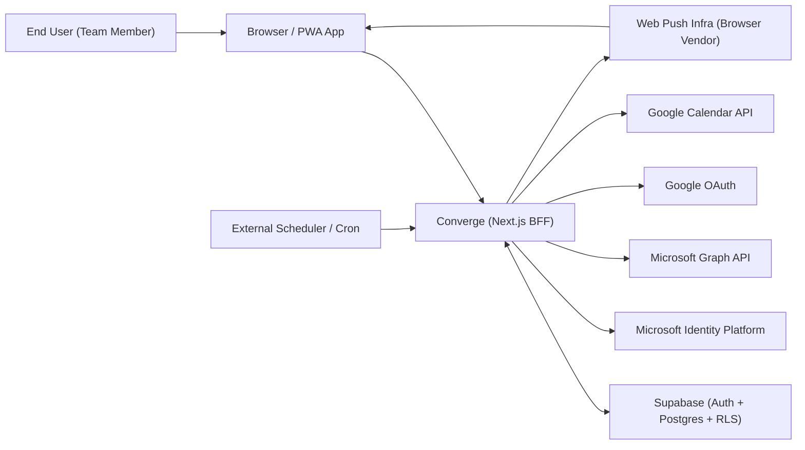
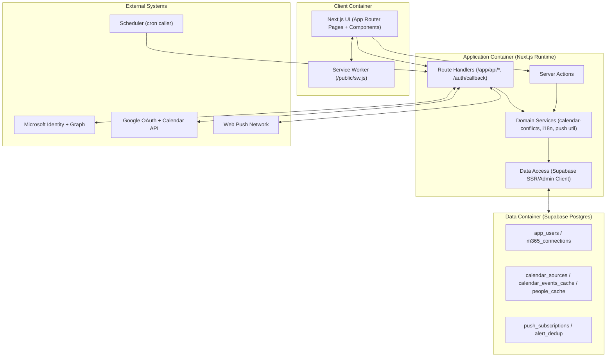
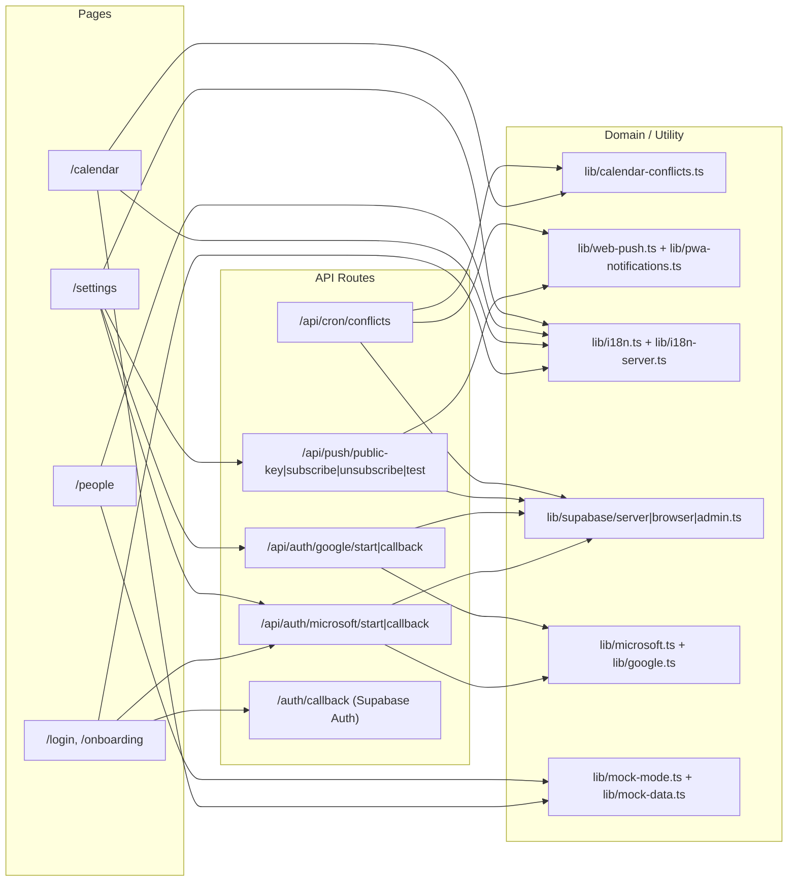
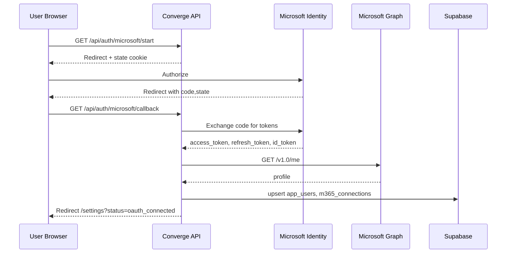
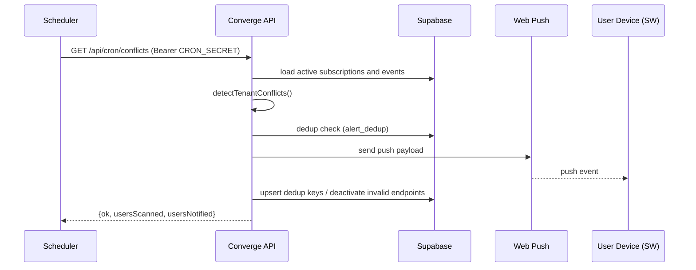

# Converge Architecture Overview (C4)

기준 코드 시점: 2026-02-18  
대상 시스템: `/Users/cnt-22-70004/Documents/Converge`

## 1) Level 1 - System Context

요약:
- 사용자는 브라우저/PWA를 통해 Converge에 접속합니다.
- Converge는 Supabase를 시스템 오브 레코드로 사용합니다.
- 외부 캘린더/디렉터리는 Microsoft/Google API와 OAuth로 연동됩니다.
- 충돌 알림은 Web Push로 사용자 디바이스에 전달됩니다.

## 2) Level 2 - Container

## 3) Level 3 - Component (Next.js App 내부)

## 4) 외부 연동과 통신 규격

| 연동 대상 | 용도 | 프로토콜/규격 | 주요 엔드포인트 |
|---|---|---|---|
| Supabase Auth | 매직링크/세션 | HTTPS, Supabase Auth | `/auth/callback` |
| Microsoft Identity | OAuth 인가/토큰 교환 | OAuth 2.0 + OIDC, `application/x-www-form-urlencoded` | `/oauth2/v2.0/authorize`, `/oauth2/v2.0/token` |
| Microsoft Graph | 사용자 기본 정보 조회 | HTTPS JSON REST (Bearer Token) | `https://graph.microsoft.com/v1.0/me` |
| Google OAuth | OAuth 인가/토큰 교환 | OAuth 2.0 + OIDC, `application/x-www-form-urlencoded` | `https://accounts.google.com/o/oauth2/v2/auth`, `https://oauth2.googleapis.com/token` |
| Google Calendar API | 캘린더/이벤트 동기화 | HTTPS JSON REST (Bearer Token) | `calendarList`, `events` |
| Web Push | 브라우저 푸시 전달 | Web Push Protocol + VAPID | `/api/push/*` + 브라우저 푸시 endpoint |
| Cron Caller | 충돌 스캔 트리거 | HTTPS + Bearer Secret | `/api/cron/conflicts` |

## 5) 핵심 시퀀스 다이어그램

### 5.1 Microsoft OAuth 연결

### 5.2 충돌 감지 + 푸시 알림

## 6) 구현 성숙도 메모

- Microsoft: OAuth 연결/토큰 저장은 구현됨. 대규모 백그라운드 동기화 파이프라인은 로드맵 단계.
- Google: OAuth 후 캘린더/이벤트 스냅샷 동기화까지 구현됨.
- People 데이터: 현재 UI는 `people_cache` 조회 기반이며, 지속 동기화 잡은 확장 여지(`sync_jobs`)가 남아있음.
- Mock 모드(`NEXT_PUBLIC_USE_MOCK=true`)로 외부 연동 없이도 주요 UI 검증 가능.

## 7) 근거 코드

- `/Users/cnt-22-70004/Documents/Converge/README.md`
- `/Users/cnt-22-70004/Documents/Converge/app/api/auth/microsoft/start/route.ts`
- `/Users/cnt-22-70004/Documents/Converge/app/api/auth/microsoft/callback/route.ts`
- `/Users/cnt-22-70004/Documents/Converge/app/api/auth/google/start/route.ts`
- `/Users/cnt-22-70004/Documents/Converge/app/api/auth/google/callback/route.ts`
- `/Users/cnt-22-70004/Documents/Converge/app/api/cron/conflicts/route.ts`
- `/Users/cnt-22-70004/Documents/Converge/app/api/push/subscribe/route.ts`
- `/Users/cnt-22-70004/Documents/Converge/public/sw.js`
- `/Users/cnt-22-70004/Documents/Converge/supabase/migrations/0001_init.sql`
- `/Users/cnt-22-70004/Documents/Converge/supabase/migrations/0002_provider_expansion.sql`
- `/Users/cnt-22-70004/Documents/Converge/supabase/migrations/0003_web_push.sql`
